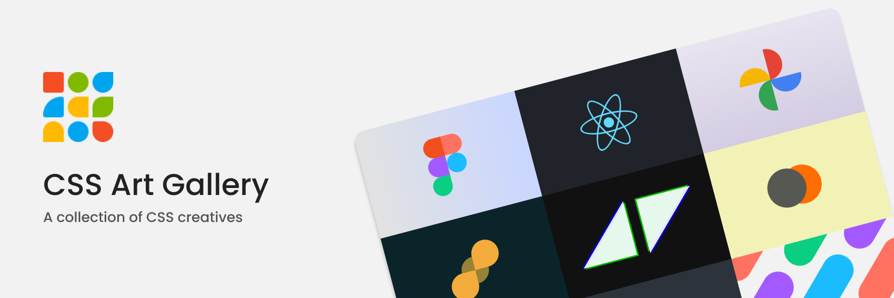

# CSS Art Gallery &middot;  [](LICENSE) [](README.md) [](https://app.netlify.com/sites/css-art-gallery/deploys)





## Run the project
Run the `yarn start` command in the terminal

This command will run the app in the development mode.
Open http://localhost:3000 to view it in the browser.

The page will reload if you make edits.

<br />

## Some rules and suggestions for making the CSS Art.

1. Create your folder inside the `/art` folder.
2. The folder name should be as follows. YourName + ArtName <br />For example, SalilNaikTeddy,
3. Give [gradient](https://uigradients.com/) or solid background colours to the `.container` class. Kindly do not keep the background white in colour.
4. To test your component, import your component to app.js. DO NOT FORGET to remove the import from App.js before you push. Since multiple contributors are going to contribute at the same time, almost every contributor will get merge conflicts. So, edit app.js file only for test purpose, DO NOT push app.js changes to GitHub.
5. Check out `index.css` for common CSS. DO NOT EDIT THIS FILE.
6. If you are coding an object inside the container, for example, a logo, a geometrical shape or an object, kindly make sure the total dimensions (width and height) do not exceed 150px. You may take up to 180px only when required. 
7. Do not copy the code from elsewhere. If I find any code has been plagiarised from some other platform, I'll have to revert the PR and block you from making any further contributions. 
8. Please create an issue and start working only after it is assigned to you. During live sessions, you may directly start working without having the issue assigned to you as it might not be feasible for me to assign issues to individuals. But it is important to create an issue so that others don't work on the same art as you are working on. 
9. When you create a pull request, please specify the `updates` branch as all the contributor's changes are going to be merged in the `updates` branch and then to the `main` branch. 

### Folder Structure

```
frontend
├── art
│   ├── 1_template (this is the template)
│   │    ├── template.jsx
│   │    └── style.module.css
│   |
│   ├── SalilNaikTeddy
│   │    ├── SalilNaikTeddy.jsx
│   │    └── style.module.css
│   |
│   └── RajCar
│        ├── RajCar.jsx
│        └── style.module.css
│
└──  App.js
```

<br />

## React Component Conventions

1. **Strictly** follow [PascalCase](https://techterms.com/definition/pascalcase) naming convention for naming React Components.
2. Import CSS module file as **style** in all the pages and components. Example, `import style from 'style.module.scss'`
3. Do not edit or remove anything from the template provided. Only add the code where you are told to add.

<br />

## Prerequisits

| &nbsp;                                                                     |
| -------------------------------------------------------------------------- |
| Download [Node JS](https://nodejs.org/en/)                                 |
| Download [Git](https://git-scm.com/)                                       |
| Learn about [CSS Modules](https://css-tricks.com/css-modules-part-1-need/) |
